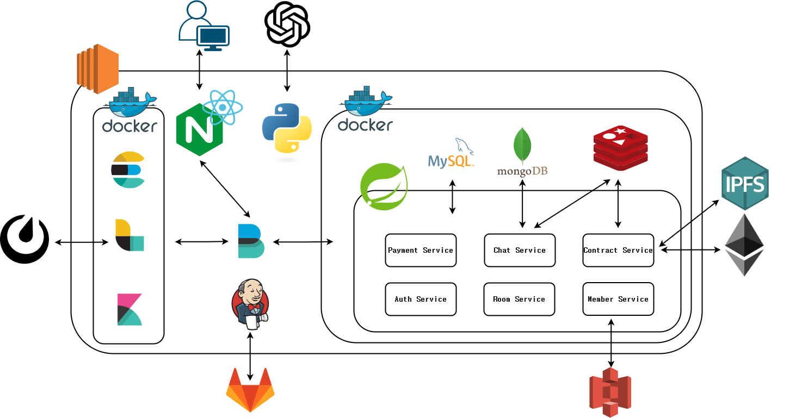
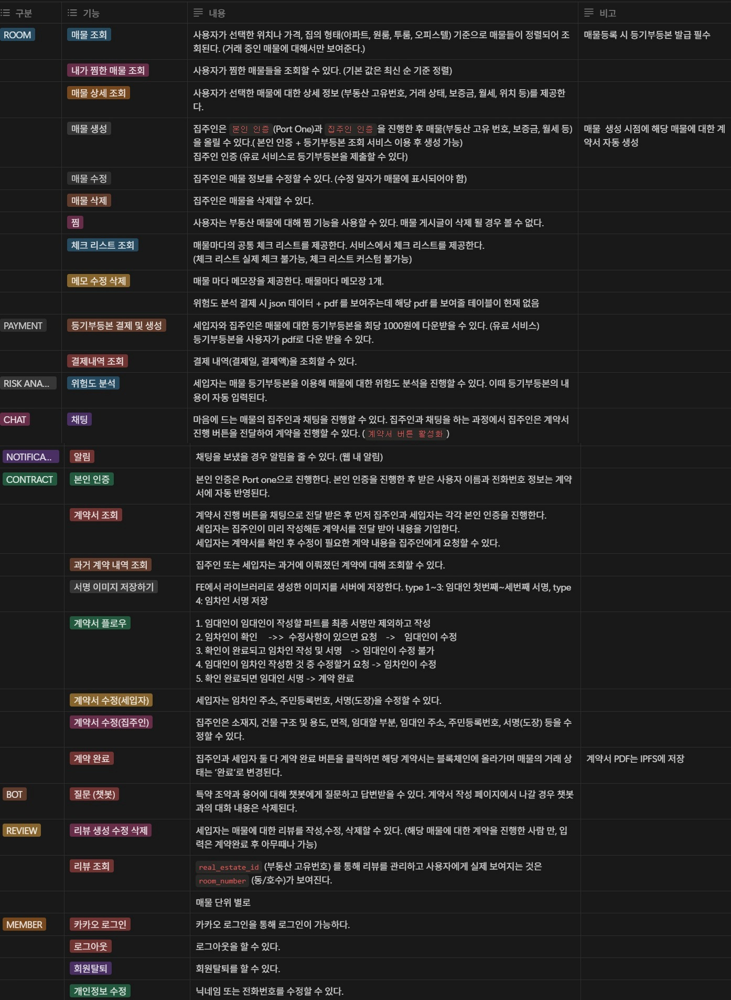
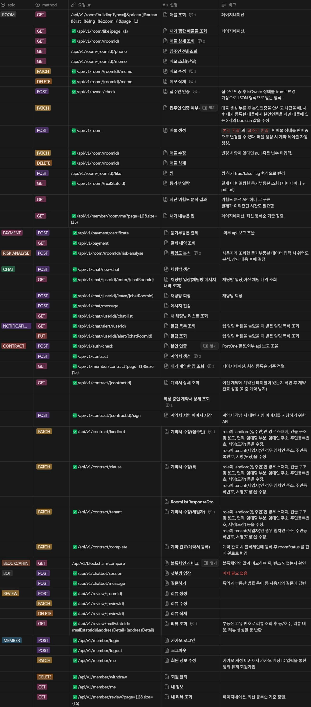
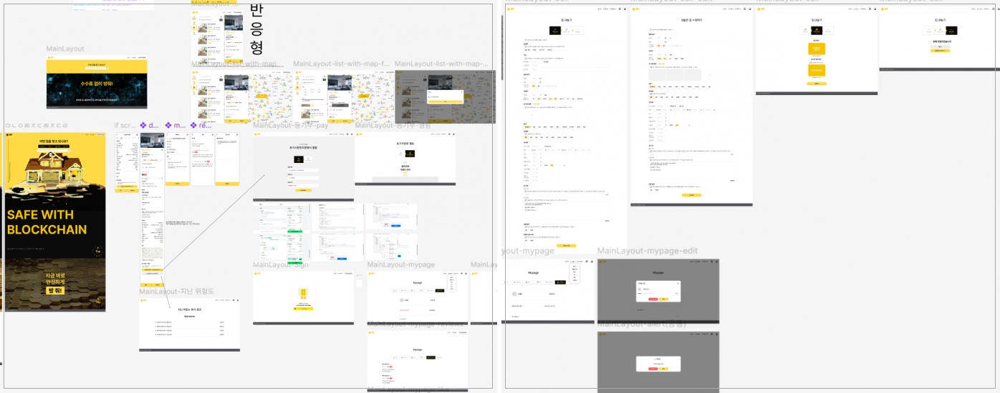
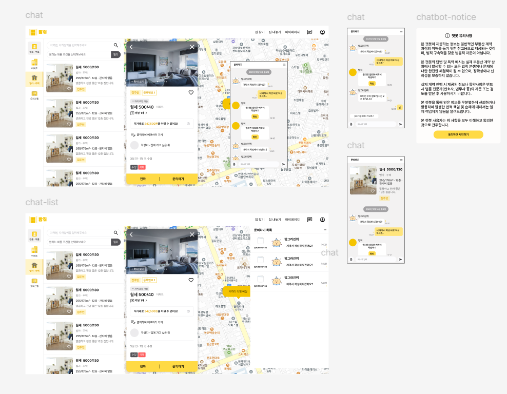
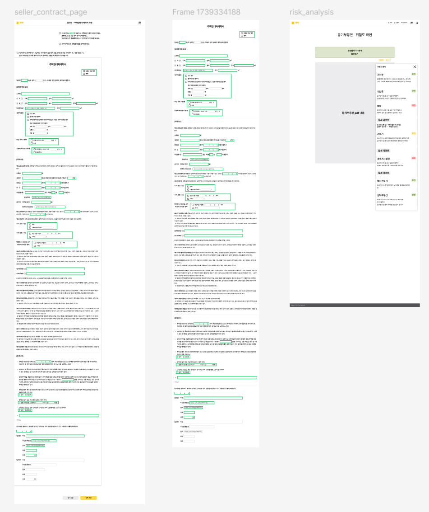
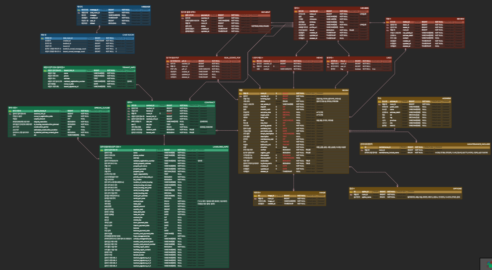

 
# 🏠 방줘 : 중개사 없이 싸고 안전하게  
> 블록체인 기반 원스톱 부동산 거래 플랫폼  

---

## 📌 프로젝트 소개

**"방줘"**는 부동산 중개 수수료와 사기 위험을 줄이기 위해  
**AI와 블록체인을 결합**하여 만든 부동산 거래 플랫폼입니다.

- 맞춤형 매물 탐색부터 계약 체결까지 한 번에!
- 계약서 작성이 어려울 땐 AI 챗봇이 도와드립니다.
- 계약은 블록체인에 기록되어 위변조 걱정 없이 투명하게!

## 시스템 아키텍처처

  

---

## ⚙️ 기술 스택

| 분야 | 기술 |
|------|------|
| **Frontend** | React, Typescript, TailwindCSS, TanStack Query |
| **Backend** | Spring Boot, Spring Data JPA |
| **Database** | MySQL, Redis, MongoDB, AWS S3 |
| **Infrastructure** | AWS EC2, Docker, Nginx |
| **Blockchain** | Remix, Truffle, Solidity, Web3.0 |
| **AI** | OpenAI API (GPT 기반 챗봇) |

---

## 요구사항 명세서

  

## API 명세서

  

## ✨ 주요 기능

1. **맞춤형 부동산 매물 탐색**  
   - 사용자의 조건 기반 필터링 (위치, 가격, 구조 등)
   - 즉시 확인 가능한 매물 카드 뷰 제공

2. **AI 기반 스마트 계약서 지원**  
   - 계약서 항목 실시간 설명
   - 법률 용어 및 특약 조건 이해 보조

3. **블록체인 기반 계약서 관리**  
   - IPFS 및 블록체인 기록으로 위변조 방지
   - 투명하고 신뢰성 있는 거래 제공

4. **등기부 기반 사기 예방 시스템**  
   - 등기부등본 자동 판독 및 위험도 분석
   - 사기 위험 매물 사전 경고 제공

5. **계약서 작성 보조 시스템**  
   - 챗봇 연동을 통한 용어/조항 실시간 설명
   - 사용자 중심의 직관적 계약서 작성 환경

## Figma

  
  
  

---

## ERD

  

---

## 🙋 팀원 소개

| 이름 | 역할 | 담당 |
|------|------|------|
| 김범준 | PM, Backend, Infra | 일정관리, 채팅/포트원, 서버 |
| 강현지 | Frontend | 계약서/채팅/챗봇, 영상 제작 |
| 백지민 | Frontend | 메인페이지/매물/회원/Info |
| 강보영 | AI | OpenAI 챗봇 시스템 |
| 하정수 | Backend, BlockChain | 블록체인, 계약/암호화 |
| 황인준 | Backend | 환경설정, 매물/회원/로그인 |
