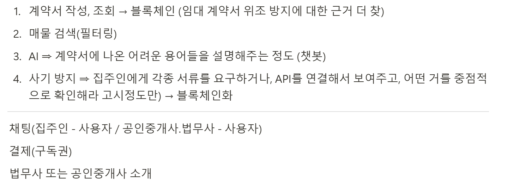

## 1일차

1. 기획 회의 + 컨설턴트 님과의 회의
2. 그라운드 룰 설정
3. 기술 스택 및 역할 논의

### 1. 기획 회의 + 컨설턴트 님과의 회의

- 기획 아이디어로 부동산 계약, 인디 게임 크라우드 펀딩, 헌혈 제시
- **부동산 계약**: 볼륨이 커질 수 있다는 우려 존재
- **인디 게임 크라우드 펀딩**: 크라우드 펀딩을 블록체인으로 해야 할 이유 및 많은 크라우드 펀딩 중에서도 인디 게임으로 집중하는 이유 등에 대한 차별성을 가질 필요 제시
- **헌혈**: 헌혈에 대해 지식이 많은 사람이 없어 기획 논의가 더뎠음, 기초로는 헌혈증 없이 블록체인으로 관리하는 아이디어로 논의

- 이후 컨설턴트 님과의 회의 진행, 이하 회의 메모(\*아직 정돈하지 않았습니다)

```
싸피 깃에 Help에, 메뉴얼, 그리고 블록체인 싸피 월렛 들어가면 참조 가능

펀딩 관련해서, 해본 사람으로

공연 열려고 펀딩 열거나,
굿즈 판매 재단 기부, 이렇게 쓰일 거라고 공지하고 시작하는 게 기본?

얼마를 어디에 어떻게 썼어요도 제공하긴 했다?
ㄴ어떻게 사람들이 알 수 있게 할까

해본 사람은 알지만, 안해본 사람은 불분명해서 안하니까 그런게 잘 드러나면 좋겠다?

블록체인은 계약에 더 Fit하게 맞을듯?

티켓을 배부

무결성,, 블록체인 의미는 있지만, 근간이 명확해야 더 나오는 게 있을 텐데..

펀딩을 여기저기서 하고, 이용되는

펀딩이 성공적으로 끝나서 모두가 만족했다면 구독 등으로 지속 유지하는 서비스 등은 찾을 수 있을 듯

정기기부처럼 이어지면 좋겠다는 생각을 했었음

아마추어 공연자

관객을 모으는?

창작자 보호 블록체인
작곡한걸 블록체인화함
인디 작곡가가 수익없이 갈취당하는 일이 많아서

> 그들의 수익을 보호하기 위해 블록체인화

권리를 주장하고, 창작권한을 보호하고 싶다

NFT화하고, 추천해주고,,,,

부동산 중계

이런거 만들고싶었다

중계수수료 너무비쌈
집 하나 봤을뿐인데 너무 비쌈

공인중개사를 거치지않고 스마트 컨트랙트가 될 때,,

등기등본,, 스캔,,

부동산플로우 법 공부는 해야겠지만

온라인 부동산 같이 해서, 중개사 없이 하는 게 꺼리가 있고 의미가 있어보임

수수료는 너무 많은데 사기에는 책임지지않음
ㄴ그래서 당근에 건물 올려서 사고팔고 법적사람 공증 맺어서 많이 함
부동산중개인 빼고 플로우를 타보자
직방, 다방같은 사이트 어플에서 집을 볼 수 있어야 하고,

안전하다는 느낌 주면서 계약완료

근데 할 게 너무 많음

그래서 계약에만 포커스 생각

질문: 전세사기를 어떻게 예방?
근저당이나, 집에 대출이 얼마나 있는지 등 비율로 얼마나 안전한지 파악

어떤 자료를 봐야하는지 플로우제공하거나,,

수시로 집을 보진 않으니까 보통 뭘 봐야 하는지 모름

집 구하기 전 봐야하는 서류세트 블록체인?

법무사에서 해주거나,,

과연 정말 전세사기, 계약을 잘 모르는, 법을 잘 모르는 사람이 알 수 있게 체크리스트를 제공하는 것부터 시작하면 MVP가 될지도?

법무사도 와서 수익을 내고,

만나서하는것보단 싼?

파는 사람, 사는 사람, 법무사 다 윈윈하는

서비스를 먼저 생각하고, 생각을 열고 해보기

탈중앙화가 아니게 할 명분이 납득되게는 하기

소소하게라도 그걸 정리? 모든 게 탈중앙화할 필요 없이

명분하나 만들어서 소소하게만

플랜 B: 너무 만들고 싶은 서비스가 있으면, 일단 하고 블록체인 서비스라고 소개하지는 않기

핀테크 블록체인과 연결하려했는데 은행 자체가 중앙화된 집합체. 공존할 수 있을까?
ㄴ전체가 탈중앙화인 게 아니고, 은행에서도 블록체인인 게 있을 것, 일부의 특수성이 있는 게 있으니까 막힐필요 없음..

모든 게 오픈체인일 필요없이 온체인과 오픈체인을 구분해보기..
```

- 이후 부동산 관련 서비스를 기획하는 것으로 의견이 모임
- 핵심 기능 논의 후 아래와 같이 정리
  
  - 구분선 아래의 것들은 상대적으로 중요도가 낮은 기능에 해당함

### 2. 그라운드 룰 설정


- 회의 후 간단하게 그라운드 룰 작성 완료

### 3. 기술 스택 및 역할 논의

- 프론트는 웹 서비스 개발을 진행하고 싶다는 이야기를 나눔
- 프론트의 기술 스택은 React, TailwindCSS, React query(상태 관리), TypeScript(\* 만일 이로 인해 개발이 더뎌지거나, 서비스에 적합하지 않다고 판단되면 JS로 전환)을 사용할 것으로 논의

## 다음 날 할 일

- 목요일부터 Figma 및 ERD 계획 시작을 목표로 기획 Develop 및 정리 회의 진행
