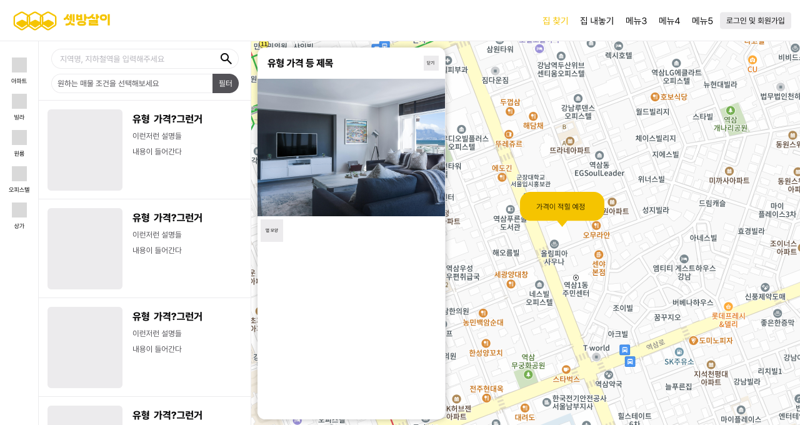
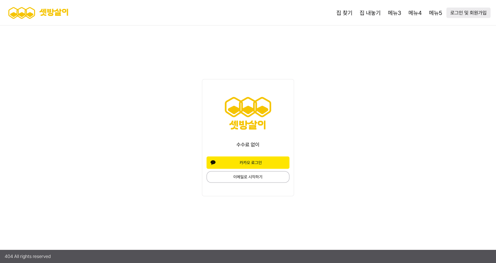
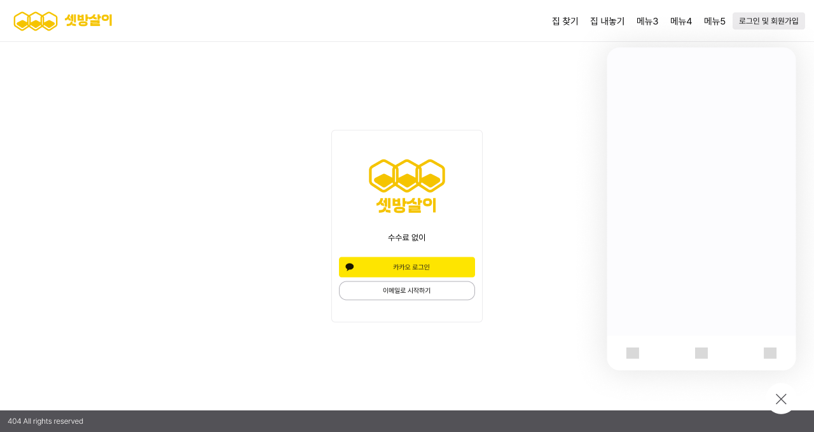

## 3일차

1. 컨설턴트 님과의 회의 + 기획 회의
2. Figma 작업 진행

### 1. 컨설턴트 님과의 회의 + 기획 회의

- 이하 회의 중 메모 전문(\* 정리하지 않음)
- AI를 계약서에 활용하는 것은 잘 구현되기 힘든, 난이도가 높은 기능이기 때문에 서비스의 차별점이 될 만한 다른 기능을 더 생각해 보는 것이 좋겠다는 게 주요 내용

```
**코치님1**
-1번과 2번 기능은 사실 별로 말씀드릴 게 없지만, 3번 기능이 좀 어려울 것 같다
AI 활용해서 지원하고, 빠진 내용 알려주거나 이런 방식이 위험할 수가 있는 게 AI로 생성하면 생성해낼 때마다 결과값이 달라지기 때문에 AI를 계약서에 활용하는 건 어려울 듯하다
자체적인 모델을 차라리 파인 튜닝?ㅎㅐ서 활용하는 게 낫지 않을까 생각
파인 튜닝한다고 해도 계약서 문장 자체를 임의로 추가하거나 빼거나 임의로 지적해주는?건? 3번이 정말 공수가 더 들어갈 수 있는 기능인 듯함

이미 블록체인만으로도 시간을 많이 써야 할 텐데 AI로 계약서 작성까지 지원하면 Back이 하는 일이 너무 많아질 듯. 그리고 투자만큼 성능이 나와야 하는데, 그만큼 나오기도 힘들다는 우려가 있다

그래서 3을 빼고 다른 추가 기능을 고민해 보는 게 좋겠다고 생각

부동산으로 블록체인 프로젝트를 하는 건 사실 챗 GPT에 블록체인 주제 알려줘 하면 첫 번째로 나오는 것임. 중개인 수수료 문제도 스마트 컨트랙트로 해결하고, 블록체인의 안정성을 가장 잘 보여줄 수 있는 거라

기간 안에 잘 하면 멋있게 완성할 수 있는 가능성은 많지만, 차별성을 더 줘야 함.. 3번 기능을 빼면 다른 새로운 기능이 들어와야 기존의 서비스에 비한 차별점이 더욱 부각될 것

유사 서비스의 경우 기능들이 분리돼 있음: 사기 예방... 등을 통합해서 한번에 해주겠다는 건데, 이런 프로젝트의 경우 싸피에서 보여줬을 때 그냥 이것저것 붙여놨다는 느낌으로밖에 안 보여지는 경우가 많았다
우리는 고생을 했지만, 보는 입장에서는 새로운 서비스라는 생각이 들지 않아서 보상이 적은 프로젝트가 될 수 있다는 우려

**코치님2**
슈퍼앱 OT 자료를 보셨는데, 싸피 교육생들이 API로 만들어서 쓸 수 있게 해야 하는데
생각해 둔 게 있을까요?
ㄴ많이 애매해서 뭘 제공할지 생각해봤는데 싸피 내에 모의 금융망이 있으니까 안에서 부동산을 활용해서 거래를 하는 생태계가 구축만 되면 제공할 수 있는 게 있을 거라 생각했음

슈퍼 앱을 하게 되면 코드 오픈은 반출 신청 허락받고 취업 기업에만 오픈하는 방식이 돼야 할 듯

서비스적으로는 코치1님 과 비슷한 의견이긴 한데, 어쨌든, 살짝 저도 다른 기능을 붙이면 좋지 않을까라는 생각이 들었음

서비스 흐름을 생각헀을 때 매물이 바로 보이는 건지, 매물을 넣어서 계약만 할 수 있는 건지 잘 안 그려짐

**컨설턴트님**
원스톱이라면 처음에 아예 매물?이 나오고? 중개사 없이 그것들을 봐서? 체결하고..

계약서 같은 경우는 맞게 이해한 건지 모르겠지만, 코치1 피드백을 보면 GPT에 의존해서 계약을 작성하는 건가요?
ㄴAI를 해서 하면 좋지만 튜닝하면 너무 볼륨 커질 듯해서. 양식 폼을 제공하고, 그 위에 Info처럼 올려놨을 때 어떤 정보가 보이는지 정도는 해놓고, AI는 특약사항에 대한 참고용일뿐

코치님 이어서..
그외 부동산 관련해서 근저당 볼 수 있는 내용도 있었는데 그 안에서 무엇을 어떻게 봐야 하는지 수치에 대한 감은 잘 없다. 대출 없는 게 당연히 좋겠지만 그 정도는 허용 범위인가? 등을 모르겠음 그런 걸 해소해줬으면 함
(어느정도가 위험 수위인지 알려줄 필요 있음)

다시 컨님 이어서

일단 매물부터 찾고, 매물을 추천받아야 겠지..->필터링으로 예산이건 지역이건 해서 하고..

그것들 중에, 본인들이 선호할 만한 것들을 픽하고, 비교를 하고

비교하는 게 좀 길어지면 일정 알림을 준다든지?

수요가 있으니까 빨리 계약을 해야 됨, 같은 알림 기능, 실질적인 도움

고민만 하다 팔리는 경우도 있으니까 그런 걸 서비스로 풀어봐도 좋을 듯

매물을 보는 시점이 있는데(연락하고, 계약금을 넣고 등)
그 프로세스마다 중요한 알림을 주는 기능은 어떤지..

validation 체크를 해줌?
계약서 민감하니까, 중개사 있는 건 민감한 거 잘못해도 어드바이스 해주는 거니까, 중개사 없는 서비스에선 서비스가 그런 걸 대신해야 함

어려운 용어는 GPT 등을 이용해서 해결하고, 그걸 해결하고 나면 근저당 등 크리티컬한 정보를 볼 때 의미있는 정보니까 그걸 유료화함
수수료도 줄여주니까 우리 서비스도 이득을 봐야 함. 그러니까 실결제는 두 번째 문제인데 어떤 재화의 형태로든 받아내기

우리가 브로커가 되는 거니까.. 운용하려면 뭔가 필요할 듯

최소한으로 보여주고, 좀 더 유용한 정보를 보고 싶으면 돈을 내야 돼
-> 이걸 토큰으로 받는다거나?

결국 사용자 입장에서는 무언가를 지불하면서도(소액의 대가를 치루면서) 전세 사기를 막을 수 있다는 서로간의 충족이 있다면 더 의미가 있을 듯

계약서? 페이지가? static 페이지인데, 실제로 체크했다는 것을 flag로 박아주는 걸 메뉴화한다거나.. 간과하지 않게...

송금을 할 때 부당한 요청 받은 거 아닌지 체크하곤 하는데 그런 식으로 약간의 불편을 주면서 확인 확인 확인 확인, 이게 다면 비로소 체결 기본 조건이 된다든가 하는 게 더 들어가면 좋겠다..

정리가 잘 되긴 했는데, 어떻게 보면 뻔한 내용일 수 있는 것 같아서 코치 님들이 우려를 표하신 듯함

요구사항 정리하고 피그마에 스케치하다 보면 뭐가 또 보이기 시작하니까 텍스트랑 이래저래 크로스체크하다 보면 더 나갈 수 있을 듯

질문: 이걸로 확정했는가? > 예

슈퍼 앱은 어떤 걸 제공? 해보고 싶은 건지 질문

슈퍼 앱 방송을 다시 숙지해보기: 방송 다시보기에서 Boot에 있는데.. 특화 boot 맨위에 있는데, 그러니까 영상을 참고해보기..

금융망을 써서 포트를 쓰지 않고 결제를 싸피 금융망으로 대체해서..

슈퍼앱 아니라도 금융망은 별도 교보재 신청이 됨..
s3 rds, ec2도 유지되고 외부 접속도 되니까 해보고 싶다..

> 걱정되는 건 로그인 같은 경우 싸피 로그인으로 하는데 그렇게 되면 취업할 때 제출하면 한 번 접속해보고 싶어할 것 같은데 로그인을 따로 싸피생이 아니면 못하니까 제약사항들이 있을지.. 외부 API도 못쓸 수 있다고 명시가 되어 있어서 어떤 것까지 제약사항이 있는지 알고 싶다..
ㄴ슈퍼앱 오늘 11시까지 신청 받음
>

어쨌건 무결성.. 스마트 컨트랙트 같은 명분은 있으니까, 어떤 요건이 충족되면 스마트 컨트랙트가 시행되는 건가요? > 다음 주에 물어보려고 하고 있다.. 계약서가 완료된 시점에서 스마트 컨트랙트 주소가 생성되고 계약서 핵심값, 날짜, 개인키가 저장돼있고, 원본 pdf는 s3나 탈중앙화 저장소가 또 있다고 해서 그쪽에 해보면 어떨까 라고 생각중..

할 일 많은데 갑자기 집 보러가고 부동산과 연락하는 데 제약 많고, 주말까지 기다리기엔 집이 나갈 것 같고.. 빨리 해야 할 것 같은 그런 걸 해소해주기

필터링.. 지역의 특수성.. 여기는 매물이 저렴한대신 치안은 위험해.. 등 특수성을 가져올 수 있는 데이터가 있다면 그런 걸 제공하는 게 의미가 있을 듯..

계약할 때마다 기억이 잘 안 나고, 그런 것들에 대해서, 한 번 했을 때 이거는 기억해야 할 것 같다는 걸 마이페이지에 메모장으로 남겨놓는다거나, 주인과 있을 때.. 소소하지만 필요한 것

딴 데 깊숙히 있다가 찾으려면 한참 걸리고 분실되니까 관련 정보를 여기 모아두는 것..

막상 살아보니까 이건 아닌 것 같은데 다음엔 이런 거 고려해봐야지..
처음 집 구했을 땐 공간 좁아도 건물이 쾌적해야 한다 생각
->살다 보니 이게 아니라 넓고 쾌적해야 함
->그리고 건물과 건물 사이에 창문이 있으면 창문 거리도 중요. 창문 열었을 때 바로 다른 집 보이는 거 불편. 음식물 쓰레기 버리는 장소 같은.. 것 중요..

등의 소소한 페인? 포인트? 를 잡아보기..

처음엔 월세.. 이런거였는데 다음엔 이런 것들이 있었으면 좋겠다.. 하면 관련 매물을 추천해주는 건 어떨까..

소소하지만 실질적인 거잖아요, 사람 심리가 살다보면 계속해서 불편점이 생길 수 있을 텐데 그런 걸.. 좀 더 실질적으로.. 사회초년생을 위해서 생활편의를 위해서 서비스를 생각해 보면 어떨까? 블록체인을 그냥 하는 거고..

깡통전세 같이 내놓은 걸 계약할 뻔한 적 있었음 -> 공인중개소가 너무 멀어서 건물 앞 부동산에 갔는데 아마 경매로 내놓았을 거라고 말을 해줘서 알 수 있었는데 이런 걸 알 수 있었으면..

집에 칸막이 같이 막혀 있어서 5층인데도 반지하처럼 답답.. 채광이 중요하다고 알게 됐음

낮에도 어둡다 등.. 그런 정보들이 매물에 나올 수 있게

나의 선호도에 맞는..

정보가 있을 수도 없을 수도 있는 건데 그런 정보를 갖고 있는 걸 추천해주면 실질적으로 도움이 될 것

살다 보면 그것 이상..

코치님 자취.. 살면서 불편했던 것: 월세를 아끼고 싶어하는 편이라 보증금 올리고, 월세 낮췄을 때 조율을 할 수 있는지를 항상 중개사를 통해서 물어봤었는데 이 서비스는 중개사가 빠지니까 서로 조율을 바로 할 수 있는지.. 500에 40을 1000에 30?으로 할 수 있는지 등? 바로??
그리고 벌레가 나오는지가 중요해서.. 주상복합이면 음식점있는지를 고려..(냄새가 올라오니까..) 수압이라든가.. 직접 봐야 알 수 있는 사항들이라.. 안 가고도 알 수 있으면 좋지 않을까 생각하긴 헀음

- >이렇게 많은 불편들이 나왔는데, 이런 것들을 데이터화할 수 있는 걸 찾아보기..

셰어하우스 모집 기능을 추가한다거나..

쿨거래만 가능한 사람 있을 거니까, 주인이 문의? 질문 못받게? 차단?비활성화 시켜둔다거나.. 열려 있으면 괜찮네~ 하고 컨택할 수 있게 해본다거나?

기술적으로 풀어내야 하니까 막연하게 말고, 데이터로 수치화할 수 있는 걸 녹여내서 매물에 적용하면 어떨까..

부동산 지식도 마찬가지이고..

소소한 정보이지만, 실생활에 정말 필요한 정보들을 해주면 유익할 듯..

1:1 거래이다 보니까 직접 올려야 되는 프로세스라, 우리가 직접 넣을 생각중임

더미 데이터를 넣으려고 하는데 처음 서비스를 시작할 땐 뭘 보여줄 수 있을까??
ㄴ원래는 부동산 매물을 보여주는 API가 있다고 해서 그걸 가져와서 넣어주고, 이 서비스에서 직접 거래하는 것들을 따로 보여주는 생각을 했었는데..

그럼 두 개 유형이 필요하겠네? 네이버 부동산에서 볼 수 있는.. 여기서 볼 수 있는?
ㄴ아직까지 토의가 안 되어 있어서 더 얘기해봐야 할 듯..

> 이런 질문이 들어올 수 있으니까 물어봤다.. 그런 것도 고민할 포인트는 된다..

AI 쪽으로 개인적으로 사전지식 없어서 파인 튜닝하거나 레벨..?을 할 때 어느 정도 러닝 커브가 있을지 궁금하다
ㄴ얼마나 딥하게 들어가냐에 따라 다르다. 네이버 클로바 x를 써서 토큰비를 감수하더라도 임베딩이나 벡터.. DB호출 등을 그냥.. 벡터화시킬 때 스트링값들 다 잘라서 ..? 정킹같은 걸 다 클로바로 대체해서 한다면 그렇게 어렵진 않다.. 하지만 임베딩 단계 하나라도 딥하게 들어가려고 한다면 논문 수준 지식이 필요하다.....
ㄴ컨님: 어떤 정확도를 높이기 위해서, 어떤 영역에 AI를 활용할지부터 정의가 돼야 어느 정도 수준인지가 보일 것.. 그러니까 그것부터 확립하자..

AI.. 계약서는 레그..?를 쓰는 게 맞을 듯..
계약서 항목마다 위험한 항목인지 아닌지, 불리한.. 부작용 있을 만한 건지 분석이들어간 다음에 이런 부분이 부족하다 제시해줄 수 있는 거잖아요. 그런데 분석 자체가 파인튜닝으론 어려울 수 있겠다는 생각이 든다.. 바트 모델 같은 걸 써서 String값들을 분석해볼 순 있겠지만.. 계약서도 같은 부동산 계약서지만 매물에 따라 또 계약서가 천차만별이고, 법적인 부동산 표준 계약서가 있는데 그걸 래그에 일단 다 던져넣고 해달라고 학습을? 시키는? 그런 식으로 래그를 쓰는 게 더 나을 수도 있겠다는 생각.. 계약서.. 법률 문항을 다 벡터 DB에 다 때려박고, GPT에게 그걸 기반으로 답변해달라고 프롬프트 엔지니어링을 해두면 합법적인 답을 기반으로 답을 주니까.. 일관성은 없더라도 근거가 있으니까..

특약과 파인튜닝은 아무튼 맞지 않다.. 정확도 개선이라는 측면에서 파인 튜닝으로 접근하면 안 될 듯..
ㄴ일단 레그부터 알아보겠습니다..

어쨌든 계약이라 양쪽 사용자 롤이 필요할 듯한데, 그걸 어떻게 관리할지도 고민해보기 처음 로그인부터 나누는 방법, 등록하는 것에 따라 롤 값을 관리하는 방법 등.. 여러 개 있음.. 어떤 상황에서는 내가 평생 임차인이 아닐 수 있으니까.. 등도 고려
그러니까 하나의 유저에서 토글을 한다거나..
회원 자체는 하나지만 권한을 두개를 가져간다거나..?아니면 우리 서비스는 무조건 회원가입할 때 임대인으로, 임차인으로 받을 거라거나?

주인이 올리는 것도 시연해야 할 텐데..
그걸 보여줄 의미가 있을까요? >있을 듯한데..
그러면 고려해봐야겠죠.. 나중 가서 그러면 어떻게 보여줄지에 대한 고민을 덜 할 수 있으니까..

블록체인 부동산 주제면 그래도 레퍼런스가 많을 테니까 github 검색해서 부동산 프로젝트 한 거 몇 개 보시고, 참고할 만한 건 최대한 참고하기
```

- 이후 언제든 집을 파는 사람도 사는 사람도 될 수 있으므로, 당근처럼 회원에 역할을 나누지는 않는 것으로 논의함
- 추가로 넣을 만한 기능을 생각해봤지만, 유의미한 정리가 이루어지지는 않았음
- 대신 어떤 화면들이 나올지를 정리하고 생각해 봄(\* 이하 내용)

  ```
  - 로그인 -> 카카오 소셜 로그인
  - 카카오지도
  - 메인페이지 온보딩페이지
  - 리스트 매물 조회
  - 매물등록 ( 본인인증 )
  - 계약서 작성 ( 본인인증 : 임대인 + 임차인 ), AI 확인
  - CRUD ( 회원 + 메믈 변경 )
  - 체크리스트
  ```

### 2. Figma 작업 진행

- 이하는 완성본이 아니며, 러프한 이미지 구상(레퍼런스 참고)








- 서비스 흐름을 더 생각해 보기 위해서 화면 러프 작업만 진행
