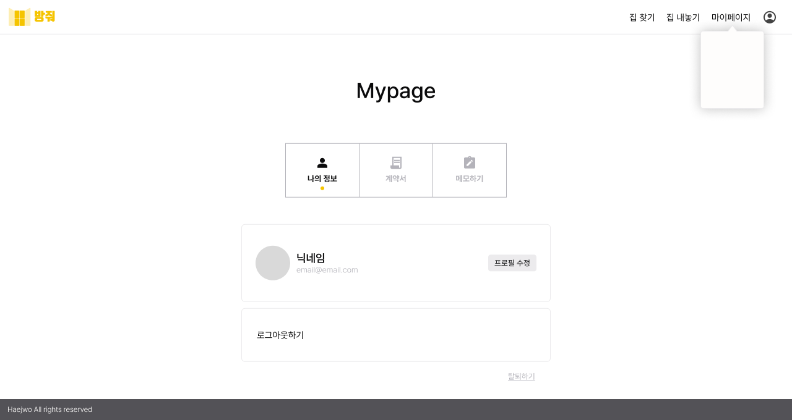
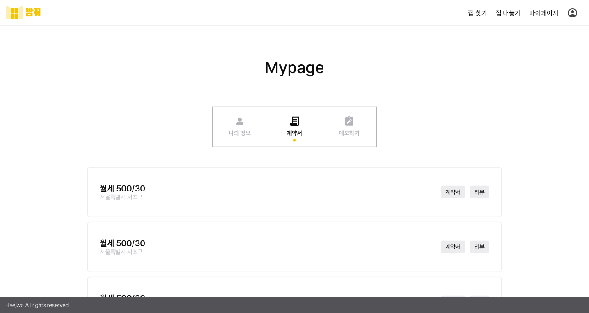
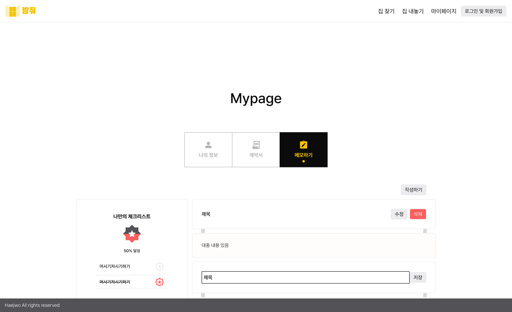
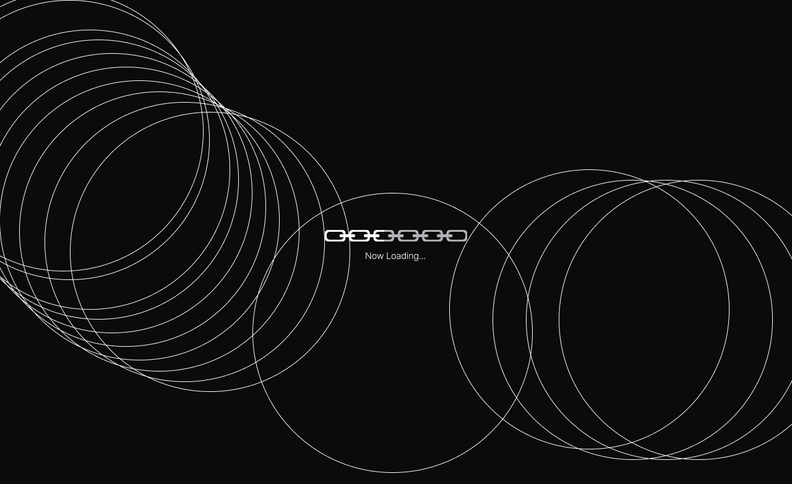
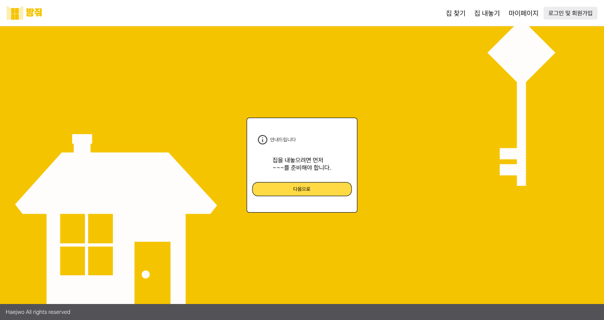

## 5일차

1. 전문가 님과 상담
2. Figma 작업

### 1. 전문가 님과 상담

- 블록체인 전문가 님과 상담을 진행, 이하 메모(\* 정리되지 않음)

```
부동산계약서

등기부등본 등은 누구나 딸 수 있게 공개된 데이터입니다. 이 계약서가 어디까지 오픈해도 되는지를 먼저 생각해봐야 할 것 같습니다. 굳이 해시값만 저장할 필요가 있는지. 개인 정보를 중요시해야 하는 것이라면 원본을 블록체인에 저장을 할 순 없을 것이다. 개인정보가 너무 많기 때문에. 그렇지만, 해시만 저장하는 건 효용이 떨어지고, 위변조에 대한 대응이 고민이 된다면 블록체인에 얘를 올리진 않고 암호화를 해서 IPS 같은 데다 올리는 걸 생각해 볼 것 같긴 합니다.
DB에는 자주 액세스해야 되는 정보나 대용량 데이터 정보 정도만 올리고, IPS에 이중화해서 저장을 한다면 문제를 해결할 수 있을 것.
이 프로젝트를 통해 얻고자 하는 것이 무엇인지. 서비스 레벨에서 생각할 것인지, 프로젝트 단계에서
블록체인만으로 전체 시나리오가 돌아가는 게 아니다 보니 우선순위를 잘 잡아야 할 것 같습니다.
현재 방법으로 하면 사실 이점이 크게 드러나진 않습니다. 당사자간 말고도 계약서를 제출하고, 전입/전출 신고를 하는 게 많은 시나리오.
플랫폼이 있다고 하면, 이 플랫폼 안에서 계약을 한 것들에 대해서는 어느 정도 보호를 할 수 있지만, 밖에서 일어난 계약들.. 한군데에서 일어나는 건 아닐 텐데, 그런 측면에서 플랫폼 바깥에서 봤을 때 연결고리, 트랙킹할 수 있는 부분들이. 그런 게 끊어지는 부분들이 조금 보입니다.
조금 어려운데.. 지금, 다른 비즈니스에서도 생각할 수 있는 방법들이 계약서 자체를 해시를 하는 것보다는, 계약서를 어떻게 잘 보호해서 저장할 거냐를 고민하기도 하죠.

컨트랙트를 배포하는 주체는 플랫폼인가요?
ㄴ네

그럼 스마트 컨트랙트를 하나를 배포를 해놓고, 계약을 ID 같은 걸 따서 계약서마다 map을 저장한다든지 이렇게 되나요?
ㄴ네, 그렇게 진행하려 했습니다.
ㄴ말씀해주셨듯 법원 표준 계약서를 찾아보니 임대인 임차인 두 명의 거주지 이름 생년월일 등이 기본적으로 들어가고 그외 보증금 월세 내용들이라 계약서 자체를 올리려면 우선 암호화를 해서 생성된 private key

해시값만 저장하려고 했던 게 계약서에 있는 내용들을 전부 chain에 올리면 가스비가 많이 나와서 그런 부분에서 효율화 측면에서 해시값만 올리려 하긴 했습니다.

IPFS 같은 것을 도입할 생각이 있나요?
ㄴ필요하다면 추천해주신 내용들을 암호화를 해서 IPFS에 저장해서 사용하는 방법도 고려는 하고 있습니다

만약 계약서를 직접 한 ? 경우에도 ? 복호화를 위한? 암호화? 키 같은 걸 저희가 보관해야 되는데 그럴 때에는 키값이나 그런 것들을 저희 서버 측에서 보관하는 게 맞는 건지도 궁금합니다
ㄴ레벨별로 생각해보셔야 할 것 같아요
지금은 DB나 중앙화된 파일 시스템에 원본을 저장하고, 해시값만 간단하게 블록체인에 저장하는 방법이죠? 블록체인 자체에다가 암호화해서 올리는 거. 이게 끝단에 있는 거고, 이거의 절충안 정도가 IPFS에 암호화된 원본을 올리고, 이것의 해시를 블록체인에 저장한 다음에 DB에서 액세스 데이터만 관리하는 이정도예요.

보안이나 DB가 다 날라갔을 때 문제가 있죠. 근데 이거는 말씀하신대로 키 관리를 누가 해야 하는지, 키가 핵심인데, 이걸 DB에 저장을 할 거냐, 시스템이 갖고 있으면 그건 그것대로 보안 이슈가 커지죠. 완전 정답은 없고, 우리 시스템에서 요구하는 보안적 요구사항이나, 백업했을 때의 재복구나 이런 것들에 따라 사실 달라져요

프로젝트 했을 때 의미있겠다 싶은 정도는 딱 절충안 정도일 것 같아요.

완전 중앙/탈중앙으로만 관리하는 명확한 트레이드오프 사이에서 이 정도 절충안이 좋아보입니다

블록체인은 어디까지나 위변조가 불가능한 DB에 지나지 않음. 위변조가 안 됨으로써 다른 부가적인 특이한 장점이 따라오는 시스템이므로, 여러분이 시스템 사용을 하면서 이런 한계도 느낄 것이고, 비용이나, 느리고 한데, 어떻게 써야 블록체인이 효용이 있지? 라는 고민을 하게 될 텐데 이점이 잘 드러나게 하려면 어쩔 수 없이 좀 UI/UX 측면에서 해결해야되는 부분들이 있어요. 인프라 뒤에서 저장하고 이런 게 사용자 입장에선 안 보이잖아요 사용자에게 효용을 주는 게 UI/UX 이런 걸로 트는 거거든요. 이런 계약서가 완전하게 저장됐다, 이런 걸 느낌적인 느낌으로 사용자에게 딱 다가갈 수 있는 UI. UX. 마냥 기다리는 게 아니라 신뢰될 수 있고 분산될 수 있는.. 그런 UI. 이런 걸 사실 안 할 순 없어요.
어쩔 수 없이 이런 게. 뒷 단에서 있는 걸 표현하는 방법이 있어야 할 것 같아요.
늘 고민하는 게 보이는 기술로 보여줄 수 있는 게 한계가 많기 때문에 블록체인은, 그렇게 하다 보면(UI/UX에서 신경을 더 쓰면) 프로젝트 완성도도 더 올라갈 것 같습니다.

감사합니다.

다음으로, IPFS에 만약 저장해서 사용하면 서버를 거치지 않고 바로 프론트에서 가져다가 쓸 수 있는 것으로 찾아봤는데, 지금 web3 라이브러리 정도까지만 못알아봤는데, 관련 라이브러리가 더 있는지 궁금합니다

web3말고도 web3의 rpc API를 다 맵핑?해둔 거거든요?

더 쉬운 사용성을 제공하는 라이브러리로 이더스 이런 애들도 많고, 제일 좋은 건 다루기 쉬운 언어로 되어 있느냐.. Java나 JavaScript 이 정돈 있는데 다른 스택을 사용하려 했을 때 지원이 될 것인지 등이 중요..

조금 쉬운 건 이더스.. 지갑 관련 API들이 좀 더 쉽게 되어 있어요. 간단히 한 번 써보시고, 이게 더 맞겠네 하는 걸 어떤 것이든 써도 사실 무방해요

이더리움 개발하는 쪽에서는 거의 다 기술스택이 정해져 있어서 어떤 걸 써도 괜찮다고 생각합니다.

기우로 얘기를 드리자면, 프론트 단에서 처리를 다 하는 건 완전 탈중앙화 방법이거든요. 사용자가 해시 키를 날리거나 했을 때 어떡해요

어느 정도의 백엔드에서의 지원을 필요할 것 같아요.

이어서 비슷한 질문인데, 스마트 컨트랙트에서 키나 이런 걸 서버에서 관리를 해서 유저들에게 제공해야 하는데, 서버 측에서 데이터가 유실된다면 대처 방법이 있는지도 궁금

키 잃어버리면 일단 대재앙.. 랜섬웨어 맞은 것과 똑같다

내가 복구할 수 있는 키가 서버에만 있는데 걔를 잊어버리면 서비스 망하는 거죠

그래서 보통 서비스할 때는 한군데에만 놓진 않죠. 이중화, 다중화하고, 백업하고, 스냅샷도 뜨고 하죠. 근데 여러분들이 이걸, 스마트 컨트랙트..?와는 또 다르다? 배포했던 주소를 알기만 하면 블록체인에서 다 데이터가 남아 있기 때문에 다 파싱해서 가져올 수 있긴 하거든요? 특정 account address를 쭉 조회를 하면 관계 있는 transaction 리스트가 쭉 나오는데 UI로 잘 나와있죠. creation한 건지, transfer한 건지, 토큰, ERC 트랜스퍼한건지 다 파싱 가능, DB에 하면 가장 빠른 방법일 것이고, 그게 아니면 파싱해서 가져오는 방법은 있을 것..

물론 컨트랙트 주소보다는 주소에서 배포했던 배포자의 address라고 해야 되나요,키관리가 제일 핵심일 거고, 그외의 재앙이라 했던 건, 키에 대한, 키에 대한 시드를 잊어버리거나, 이거는 거의 대응을 할 수가 없어요. 그래서 좀 차이를 인지하고 접근하면 될 거 ㅅ같아요. 프라이빗 키는 보통 DB에서 관리를 안 하고요. 위험하니까. 바로 털리면 진짜 엄청 극심한 피해가 있기 때문에, 그렇게 관리 안 하고 code wallet이나 이런 걸로 관리를 하고요

컨트랙트 주소는 속도가 중요하면 db에 저장하고, 복구도 해야 된다 이러면 주기적으로 스냅샷 두고 이중화도 하고

그런 방법도 있어요 컨트랙트 안에서 여러분이 컨트랙트 배포되고 나서, emit할 수 있잖아요. 이벤트. 그러니까 특정, 여러분이 식별하기 쉬운 이벤트를 넣어놓고 뿌려줄 수 있도록 구현을 해놓으면, 그것만 리스닝하면 돼요

주소에 대해서는 그렇게 찾을 수 있습니다

다음으로는 만약에 블록체인 데이터가 수정 같은 기능을 통해서 변경되는 경우는, 제일 처음에 저장하려 헀던 원본 데이터를 찾아낼 수 있는지가 궁금합니다
ㄴ일단 블록체인에는 수정/삭제 없이 C(reate)만 있어요. 근데 이게 체이닝된 상태. 원본 데이터는 스마트 컨트랙트를 배포할 때, 설계를 해놨다고 하면은, 특정 함수를 통해 계약의 내용이 업데이트됐을 때 이 이력이 쭉 남게 됩니다.
답변 드렸던 내용이랑 비슷하게
업데이트 될 때마다 특정 컨트랙트가 업데이트 됐다..

어떤 걸 emit하게 구현을 해놨어요. 어떻게 데이터가 변했는지 이런 식으로 구성을 할 수가 있어요.

여기는 insert만 된다. 그걸 시점 별로 갖고 오는 것뿐이에요. 이더리움 스마트 컨트랙트의 경우 마지막 데이터로 업데이트가 되죠. 그렇기 때문에 이력을 추적하고 싶으면 상태를 쭉 기록하는. 상태변수를 둬야 할 수도 있어요. 이용하ㅗㄱ 싶은 것에 따라, 스마트 컨트랙트를 어떻게 구현하느냐의 문제죠.

블록체인이 현업에서 어떻게 쓰이고, 어떤 트렌드가 있는지 궁금합니다
ㄴ되게 한보따린데. 되게 달라요. 분야마다 너무 다르고. 근데 우리나라에선 규제도 심하고 그래서, 엄청나게 활발히 사용되고 있진 않은 듯합니다. 근데, 약간, 아직도, 트렌드는, 요즘에는, 스테이블 코인, 이게 약간, 제도권이랑 해외에서는 제도권에 많이 편입되고 있고 법안이 마련되 고 있어서 딥파이를 놓칠 수 없어서, 딥파이가 활성화되고 있으니까 트래디셔널 파이넌셜과 연결할 수 있으니까 딥파이가 많이 만들어지는 추세요.
BAS 블록체인 애져 서비스 이런 거 많이 합니다. 블록체인이 실제 비즈니스에서는 많이 카테고라이징 되고 있는데, 블록체인이 인프라를 제공을 해야만 서비스를 올릴 수 있기 때문에 아마존 등에서도 Bas를 하고 있습니다

그런 게 있고, 요즘에는 또, 카이야? 하는 친구인데, 구 클레이튼이 카이야가 됐는데? 요즘에 그들이 제일 미쳤다고 생각하는 시장이 밈 코인 시장이래요. 얼마전에도 트럼프 취임하면서 트럼프 코인 등 많이 난리가 됐잖아요. 도덕적 문제가 있을 수 있지만 가스비가 싸서 밈 코인을 하나만 걸려라 하고, 그런 걸 배팅하고 하는 게 있다더라고요. 그런 게 계속 되고 있는데, 예전에는 관리자 툴이나 이런 걸로 사람들이 만들었으면 요즘에는 그걸 만드는 봇이 생겼대요. 요즘 트렌드가 계속 바뀌고, 사람들이 그런 토픽에 민감한 시대가 됐다보니, 그런 걸 AI 에이전트가 계속 크롤링하면서 트렌드를 포착하고, 그걸로 끊임없이 만들어요. 그걸 눈앞에서 봤는데 돌았다, 그런 긍정적인 부정적인 둘 다 있는데, 그런 것도 한축에선 계속 벌어지고 있더라고요

AI 에이전트와 결부해서 솔라나 쪽에서는 또 시장이 크구나 그런거가 눈에 띄는 것 같습니다

저희도 같이 하고 있는 프로젝트인데, 여론조사? 가 문제 되게 많잖아요. 얘기 많고 이슈 많잫ㄴ아요. 그런 걸 블록체인을 통하는데 개인정보 들어가면 안 되니까 투명하지만 믿을 수 있게 하지만 개인정보는 보호하면서 이런것들도 한축에 있습니다

굉장히 다양하게 쓰이고 있는 것 같고, 대중적으론 돈 버는 데 관심이 많다보니까 제가 말씀드린 그런 데가 제일 활발한 것 같긴 하더라고요
```

### 2. Figma 작업

- 이하는 모두 확정된 디자인은 아닙니다(계속 수정중)






- 사이트 이미지와 맞지 않는 듯하여 고민중인 페이지


