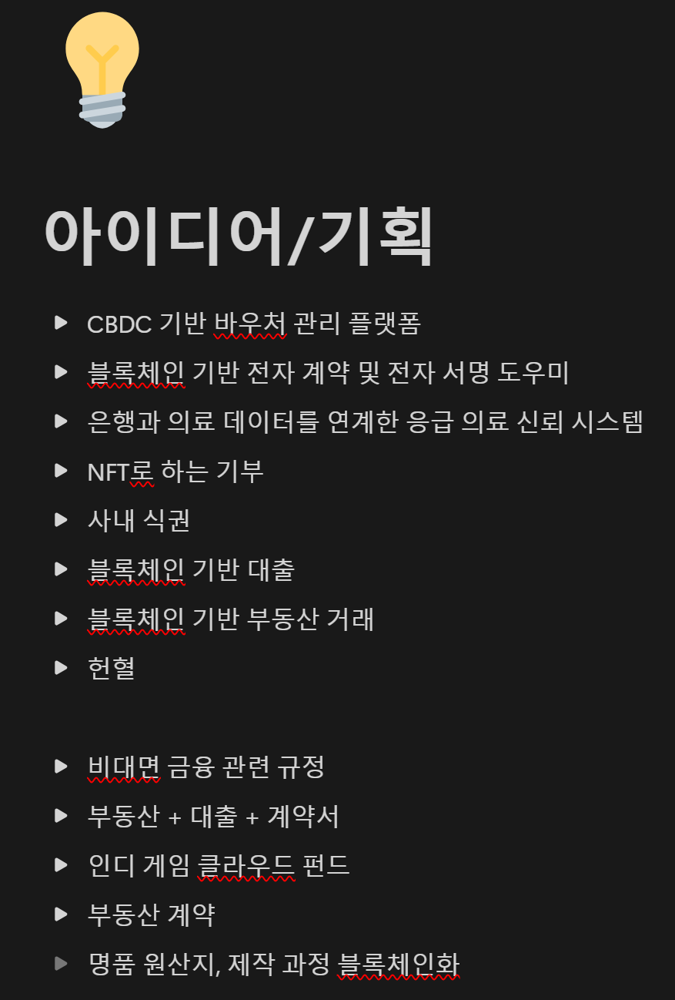
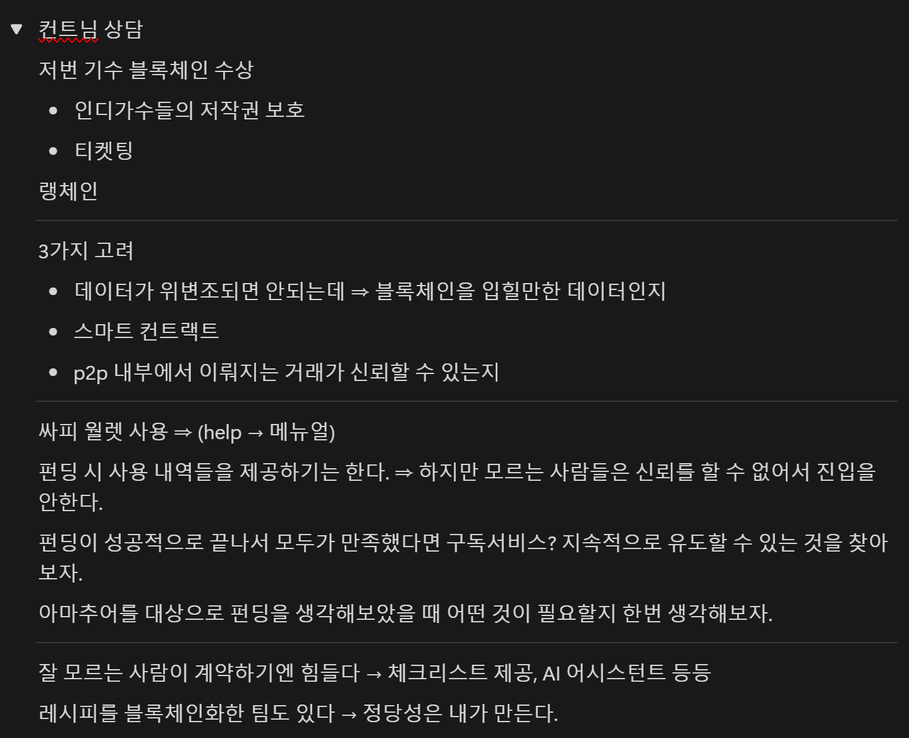
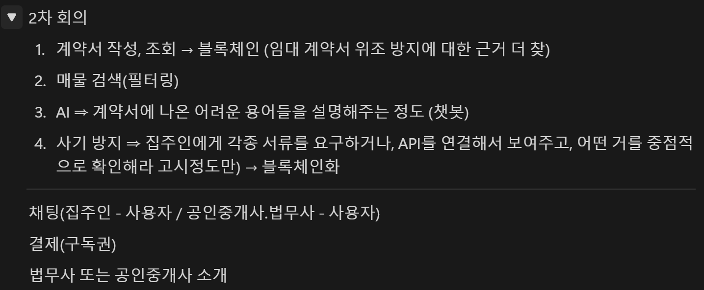
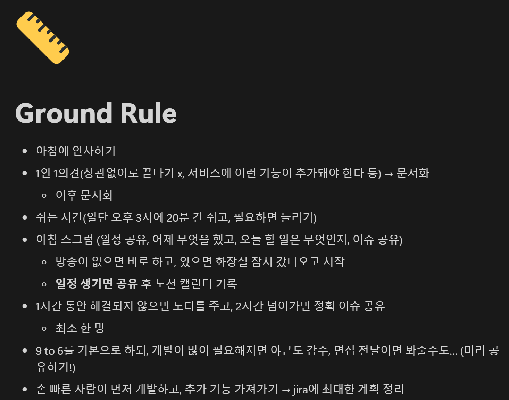

> # 1. 아이디어 회의

## 1. 부동산 계약 도우미
> 최근 부동산 사기와, 공인 중개사에 대한 불신으로 인해 부동산 거래를 직거래로 하는 경우가 늘고 있습니다.

### 기능
- 계약서 작성, 조회
- 매물 검색
- AI
- 사기 방지

### 장점
- 공인중개 비용 절약
- 블록체인을 이용한 신뢰도

### 단점
- 블록체인으로 가스비를 낼 가치가 있는가?
- 다양한 법리적 내용 학습 필요

## 2. 피드백

### 고려할 점
1. 블록 체인을 입힐 만 한 데이터인가
2. 스마트 컨트랙트
3. 보증

## 3. 2차차 회의

> # 2. 그라운드 룰 설정

