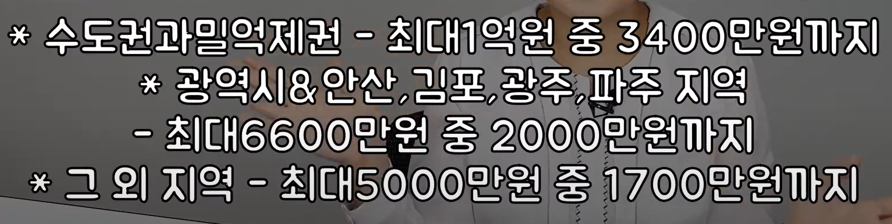

> # 1. 정보 탐색
## 1. 관련 어플
- HUG안심전세
- 집지켜 : https://savehome.kr/

## 2. 신탁 사기
> 신탁사에 위탁 된 부동산을 계약하는 경우, 정상 계약을 위해선 신탁사의 임대차 계약 허가 관련 문서를 확인해야 함, 하지만 그 문서의 확인이 어렵고 복잡하므로 되도록 피하는 것을 추천

신탁 사기 영상 : https://www.youtube.com/watch?v=K_IGrEmA7tM
법적으로 불법 계약이므로 보호 불가

## 3. 전대차 계약
> 이미 임대 계약이 되어있는 임대인과 임대 계약을 하는 경우

임대차 계약 시 실소유주와 계약 or 실소유주의 확인 필요(위임장, 인감, 위임 범위 등 확인)

## 4. 미납 세금 확인
> 세금 미납자의 경우 미납 세금의 징수가 우선이므로 확인 필요 → 23년 4월 이후 세무사에서 임대인 동의 없이 열람 가능(계약 전이나 전세금 1천만원 미만의 경우 여전히 동의 필요)

## 5. 근저당이나 가압류 등이 남아있을 시

## 6. 주택 임대차 보호법
서울의 경우 
- 전체 환산보증금(월세 X 100 + 보증금)이 1억 1천만원을 넘지 않는 경우 3700만원 까지 보호(근저당보다 우선)

https://www.law.go.kr/LSW/lsInfoP.do?lsiSeq=218963#0000
