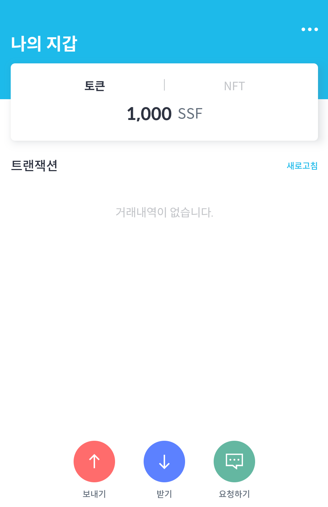
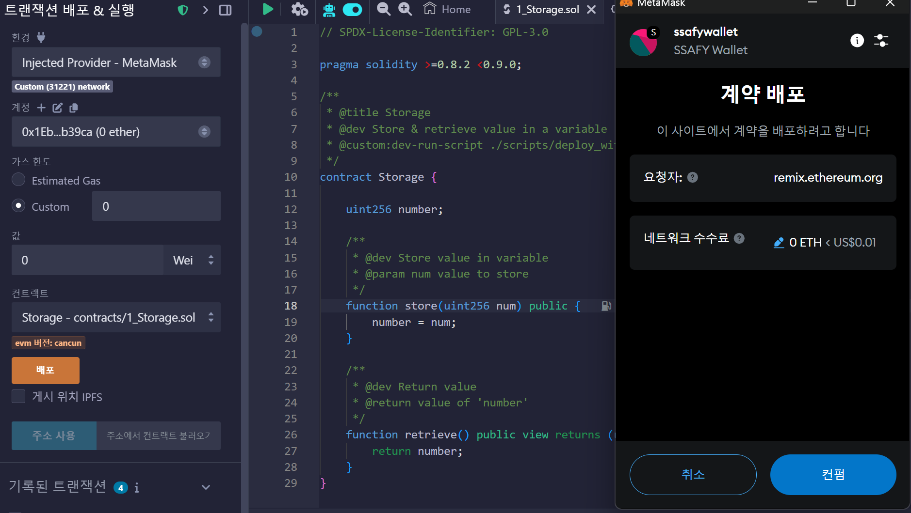
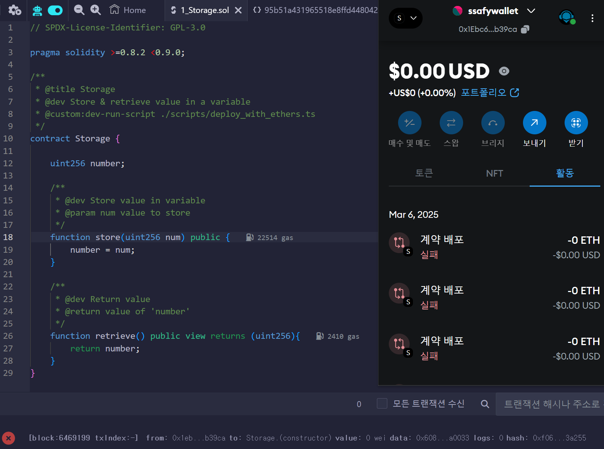
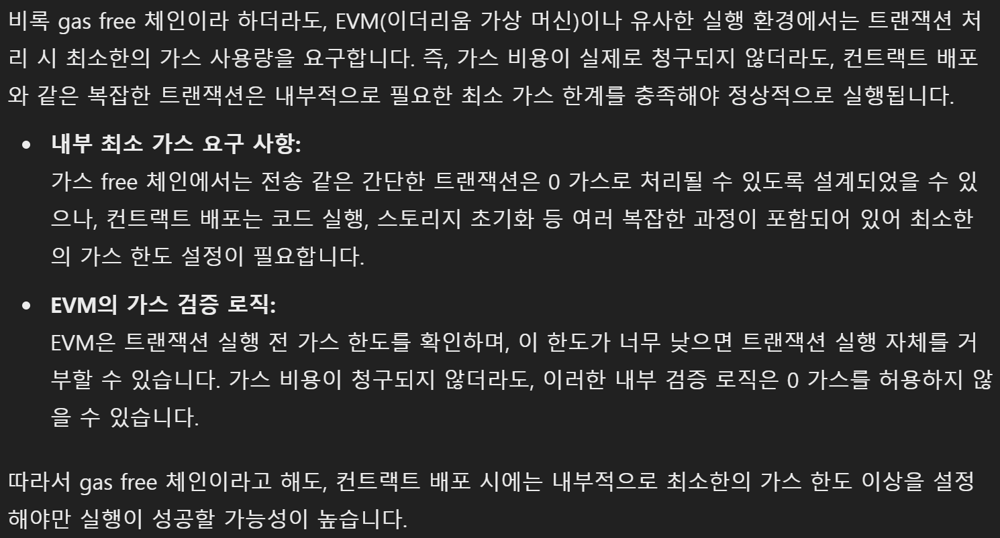

> # 아이디어 회의

## 1. 피드백
- 주요 기능 3번 -> AI로 생성해서 만들면 생성시마다 값이 달라짐 -> 모델 파인튜닝 / 문장 자체에 대한 분석, 지적 기능은 힘들다
- 다른 추가 기능으로 대체하는 것도 고려해봄직하다 ***
- 기능을 통합하는 경우 그냥 서비스들의 나열로 보일 수 있다 -> 기능의 추가 필요
- 근저당이나 그런 수치들에 대한 분석 값을 사용자가 이해하기 쉽게 보여주기
- 매물 추천 AI..?
- 매물이 중간에 나가는 경우
- 각 프로세스 별 중요 사항 알려주기
- BM계획 -> 주요한 정보는 토큰 등으로 결제
- 스태틱한 사기 예방 체크리스트를 확인 했는지 정보 제공
- 매물 볼 때 확인해야 할 체크리스트
- 다음 계약에서 사용할 현재의 정보 저장 후 다음 계약에서 고려
- 보증금 <-> 월세 트레이드 가능한지
- 조건 조율 가/불가 확인
- 실제 처음 시작될 시 어떤 데이터 보여줄지?
- AI는 RAG로 다는 것이 좋을듯.. -> 표준 계약서를 벡터DB화 시켜 비교시키도록 구현
- 양측의 역할이 있는데, 어떻게 처리할지?

## 2. 추가 회의 내용
- 추가해야 할 기능
    - 본인 확인

- 추가할 만한 기능
    - 알림
        - 잔금 납기일
        - 개인 설정에 맞는 매물 등록 시 알림
    - 해외 부동산
        - 유학, 한 달 살기 등
    - 부동산 상식 퀴즈
        - 부동산 상식 퀴즈 풀기 -> 서비스 이용 중 등기부 확인 등에 사용할 수 있는 포인트 제공
    - 월세 자동이체
        - 금융 API를 활용하여 계약 후 월세 자동이체 설정 기능 제공
    - 소득, 자산 정보 등을 입력받아 부동산 관련 복지 혜택 춴
        - ex) 청년주택, 청년주거 지원 등

## 3. ssafy wallet
- ssafy wallet 생성

- meta mask 연결 후 remix에서 컨트랙트 배포포 테스트

- 실패 

- gpt를 활용한 분석 결과
