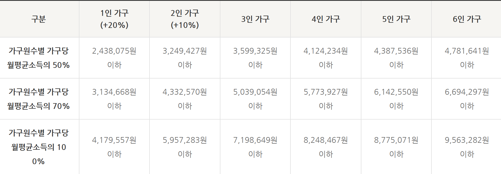

> # 아이디어 회의
## 1. 추가 기능 아이디어
- 교통 혼잡도 -> ~~시에 혼잡 정도(버스, 지하철)
- 실거주자 리뷰 -> 리뷰 공개 타이밍(부정적 정보의 경우) -> 집주인이 리뷰기능의 on/off 설정
    - 리뷰어의 신상을 집주인이 알고 있는 문제..
- 이전 거주자 채팅 매칭(포인트 사용)
- 동네 정보 제공
    - 지역에 처음 온 경우 필요한 정보

## 2. 복지 관련 찾아 본 내용

주거 복지 : https://www.seoulhousing.kr/html/0102005.do

## 3. 결정 된 추가 사항
- 리뷰
    - 매물을 올리는 사람이 리뷰 공개 여부 결정(전체 리뷰)
- 알림
    - 찜한 부동산 매물의 계약 종료 임박 알림 등
- AI챗봇
    - 부동산 거래 용어나 특약 등 질문사항 질문