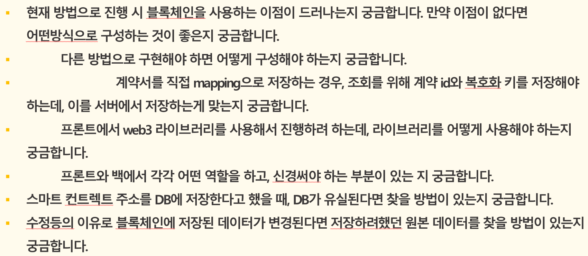
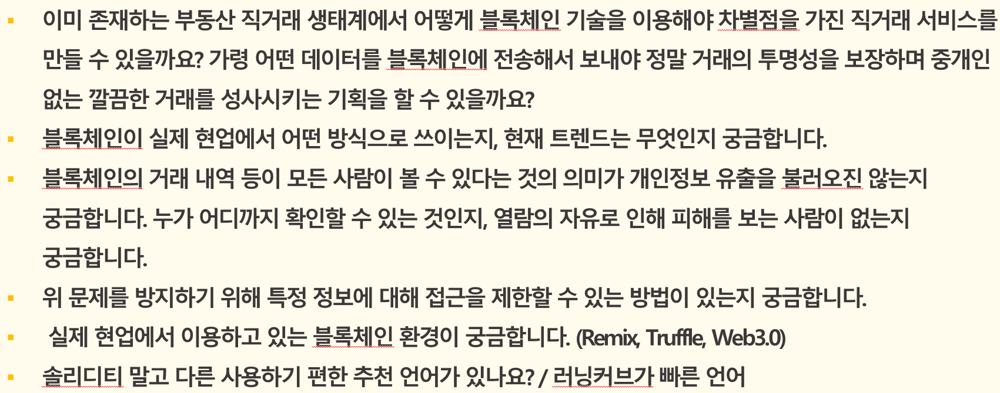

> # 전문가 상담
## 1. 질문 분류
### 1순위
- 현재 방법으로 진행 시 블록체인을 사용하는 이점이 드러나는지 궁금합니다. 만약 이점이 없다면 어떤방식으로 구성하는 것이 좋은지 궁금합니다.
	- 다른 방법으로 구현해야 하면 어떻게 구성해야 하는지 궁금합니다.
		- 계약서를 직접 mapping으로 저장하는 경우, 조회를 위해 계약 id와 복호화 키를 저장해야 하는데, 이를 서버에서 저장하는게 맞는지 궁금합니다.
	- 프론트에서 web3 라이브러리를 사용해서 진행하려 하는데, 라이브러리를 어떻게 사용해야 하는지 궁금합니다.
	- 프론트와 백에서 각각 어떤 역할을 하고, 신경써야 하는 부분이 있는 지 궁금합니다.
- 스마트 컨트렉트 주소를 DB에 저장한다고 했을 때, DB가 유실된다면 찾을 방법이 있는지 궁금합니다.
- 수정등의 이유로 블록체인에 저장된 데이터가 변경된다면 저장하려했던 원본 데이터를 찾을 방법이 있는지 궁금합니다.

### 2순위
- 이미 존재하는 부동산 직거래 생태계에서 어떻게 블록체인 기술을 이용해야 차별점을 가진 직거래 서비스를 만들 수 있을까요? 가령 어떤 데이터를 블록체인에 전송해서 보내야 정말 거래의 투명성을 보장하며 중개인 없는 깔끔한 거래를 성사시키는 기획을 할 수 있을까요?
- 블록체인의 거래 내역 등이 모든 사람이 볼 수 있다는 것의 의미가 개인정보 유출을 불러오진 않는지 궁금합니다. 누가 어디까지 확인할 수 있는 것인지, 열람의 자유로 인해 피해를 보는 사람이 없는지 궁금합니다.
- 위 문제를 방지하기 위해 특정 정보에 대해 접근을 제한할 수 있는 방법이 있는지 궁금합니다.

### 3순위
- 블록체인이 실제 현업에서 어떤 방식으로 쓰이는지, 현재 트렌드는 무엇인지 궁금합니다.
- 실제 현업에서 이용하고 있는 블록체인 환경이 궁금합니다. (Remix, Truffle, Web3.0)
- 솔리디티 말고 다른 사용하기 편한 추천 언어가 있나요? / 러닝커브가 빠른 언어

## 2. 질문 리스트

### 3. 답변
1. 

    Q : 계약서를 어떻게 블록체인에 저장해야할까요?

    A : 서비스의 기능과 타협 필요, 문서의 성격에 따라 다르다, 멘토님이라면 암호화하여 저장

2. 

    Q : 가스비를 고려해 Hash값만 저장하려 하는데 어떤가요?

    A : IPFS는 어떤가? 저장 단계에 대해 고민 필요(중앙 <-> 탈중앙) 트레이드오프 고려하여 선택, UI/UX 제공 필요

3. 

    Q : 프론트에서 Web3 외의 주목할 라이브러리가 있나요?

    A : 원리가 같지만 구현 언어따라 편한 것 선택, 개인적으론 ethers.js가 조금 더 편함

    
4. 

    Q : 스마트 컨트랙트 주소나 키, DB가 유실된다면 어떻게 하나요?

    A : 키는 잃어버리면 재앙, 컨트랙트 주소는 복구 가능, 배포자의 키, 시드가 중요 -> 보통 콜드 월렛에 저장

5. 

    Q : 블록체인에 저장된 데이터가 수정되면 어떻게 하나요?

    A : 블록체인은 생성, 조회만 가능, emit을 이용한 상태 관리를 통해 이전 기록 접근 가능

6. 

    Q : 블록체인이 현업에서 어디서 사용되나요?

    A : 국내에선 많지 않음, 해외에선 기존 금융과 스테이블 코인에 사용, 밈코인도 활성화, 여론조사 프라이버시 보장장

