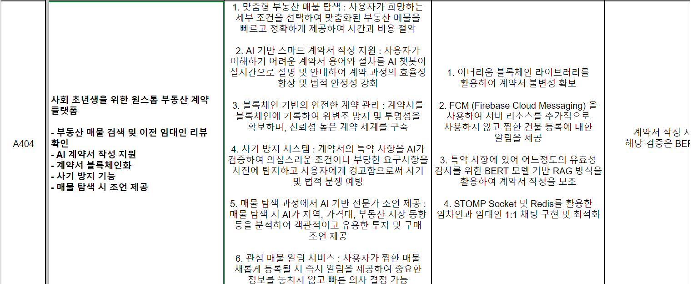

 # 4일차

 ### \[공통\] 프로젝트 추가기능 회의 및 기획 설명 명세
 - 프로젝트 기획 설명 스프레트 시트에 작성
 - 부동산 계약서 프로젝트에서 추가 기능 회의

 

 ### \[공통\] 백엔드 기능 분리 및 필요 API 구체화
 - 이후 프로젝트 진행에 있어 현재 구현 기능 구체화
 - 구현해야 하는 기능 분리 및 필요 API 리스트업
 - 이후 추가기능 까지 프로젝트 진행 리소스 측정